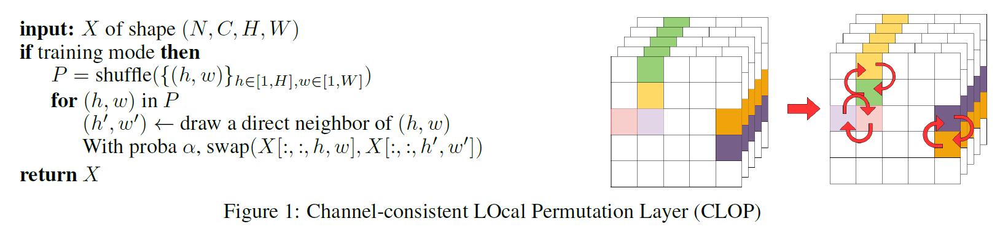
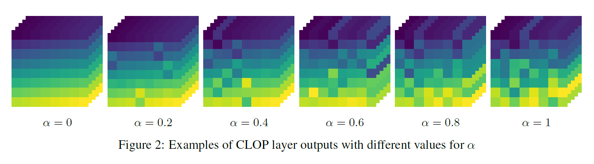
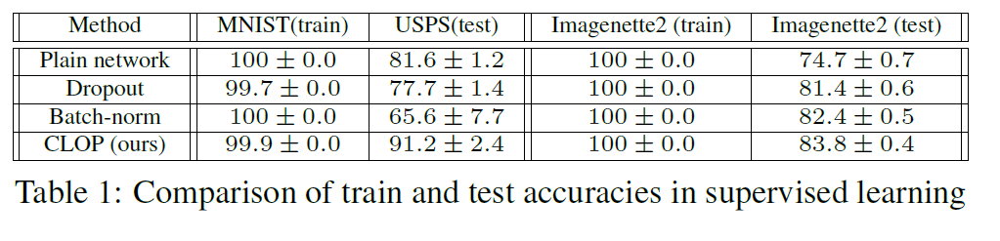
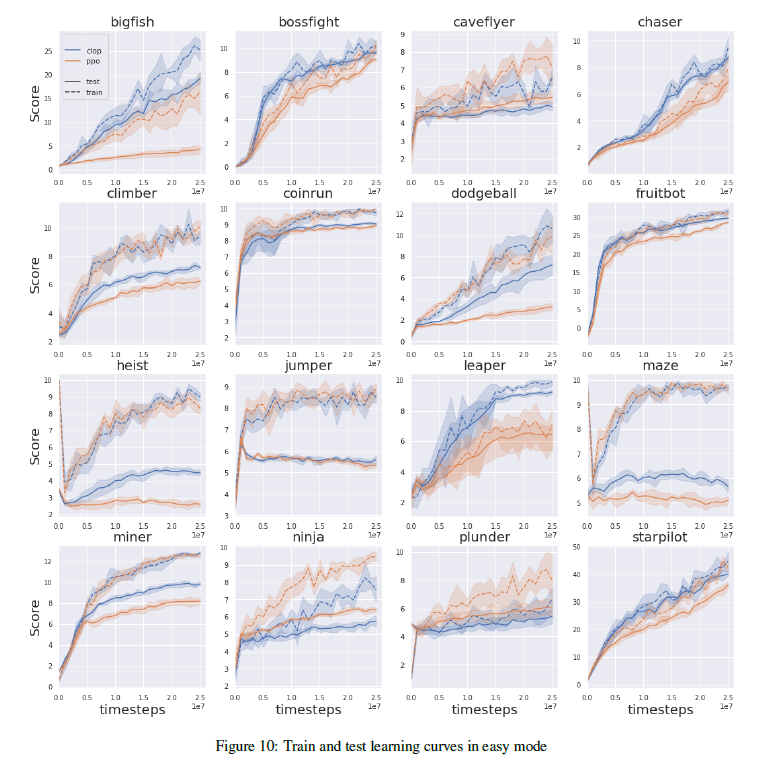
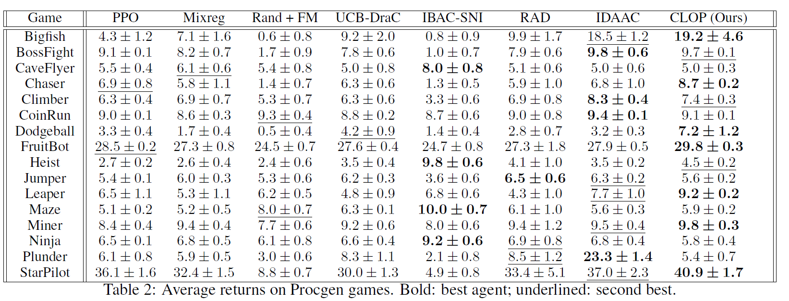

# CLOP: Local Feature Swapping for Generalization in Reinforcement Learning

Official implementation for [CLOP: Local Feature Swapping for Generalization in Reinforcement Learning](https://arxiv.org/abs/2204.06355?context=cs) by David Bertoin and Emmanuel Rachelson.

# Overview:
## Clop algorithm:
  
## Examples with different values for $\alpha$
 

## Run supervised learning benchmarks:
To run a full supervised learning benchmark:
```bash
python benchmark.py --dataset [DATASET] --dataset_folder [FOLDER] --epochs[EPOCHS] --nb_runs[NBRUNS]
```
 with: 
*  DATASET: one of ```mnist_usps, stl10, imagenette```
*  FOLDER: path to the dataset folder (usefull for imagenette)
*  EPOCHS: number of epochs by run
*  NBRUNS: number of runs for each configuration

Exemple:
```bash
python benchmark.py --exp_name mnist_usps --dataset_folder data --epochs 30 --nb_runs 5
```

Imagenette2 dataset is available on [this repo](https://github.com/fastai/imagenette).

## Results on supervised learning
  


## Train an agent on procgen:
To run an experiment on procgen:
```bash
python train.py --exp_name [XP_NAME] --env_name [GAME]
```
Or with more parameters:
```bash
python train.py --exp_name [XP_NAME] --env_name [GAME] --param_name [PARAM] --num_levels [NUM_LEVEL] --distribution_mode [MODE] --num_timesteps [TIMESTEPS] --start_level [START]
```
*  XP_NAME: experiment name for logs
*  GAME: environment name 
*  PARAM: one of the configurations available in `hyperparams/procgen/config.yml`
* NUM_LEVEL: number of unique training levels
* START: starting training level
* MODE: `easy` or `hard`
* TIMESTEPS  umber of training steps

To train a agent with CLOP add `--clop [alpha]` with $0 \leq \alpha \leq 1$.

Exemple:
```bash
python train.py --exp_name xp_bigfish --env_name bigfish --param_name easy-200 --num_levels 200 --distribution_mode easy --num_timesteps 25000000 --start_level 0 --clop 0.6
```


## Results on the Procgen Benchmark
  
  

# Citation
If you find our work useful in your research, please consider citing our work as follows:
```
@inproceedings{bertoin2021local,
  title={Local Feature Swapping for Generalization in Reinforcement Learning},
  author={Bertoin, David and Rachelson, Emmanuel},
  booktitle={International Conference on Learning Representations},
  year={2021}
}
```

# Acknowledgements
Our PPO implementation is based on [Hojoon Lee's github repository](https://github.com/joonleesky/train-procgen-pytorch)


This project received funding from the French ”Investing for the Future – PIA3” program within the Artificial and Natural Intelligence Toulouse Institute (ANITI). The authors gratefully acknowledge the support of the <a href="https://www.deel.ai/"> DEEL </a> project.